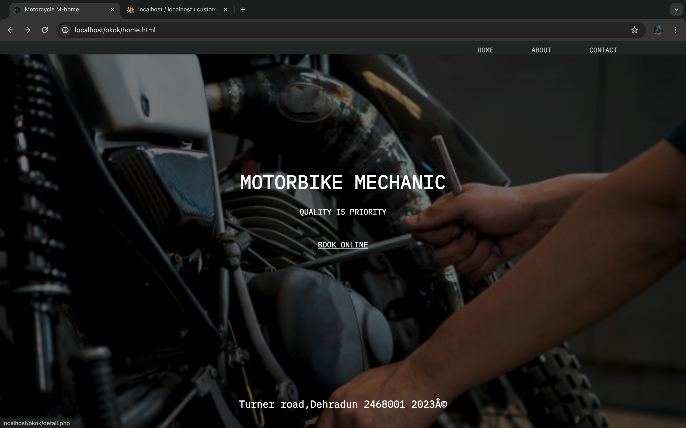
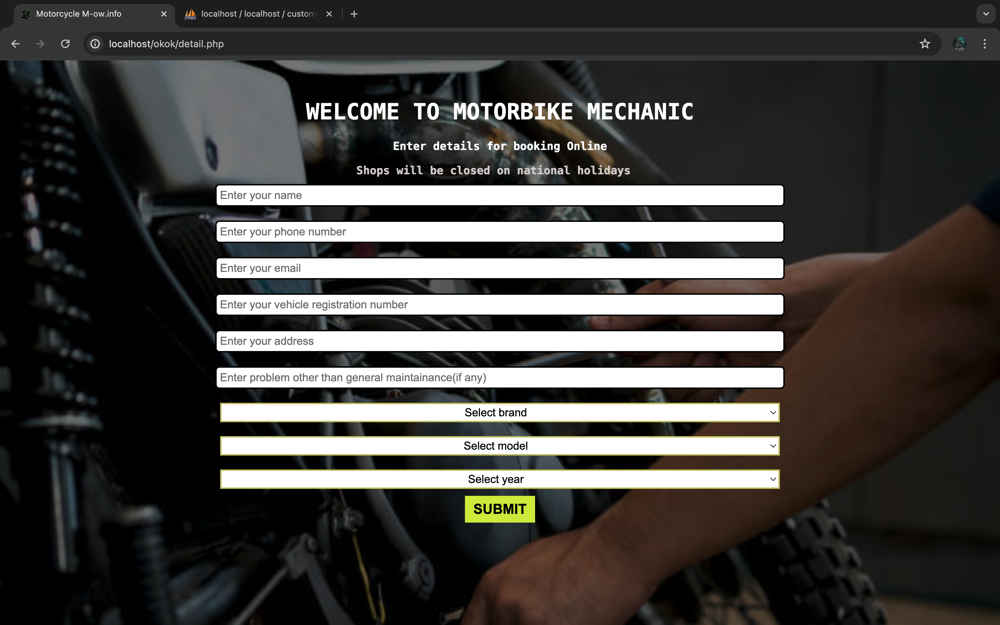
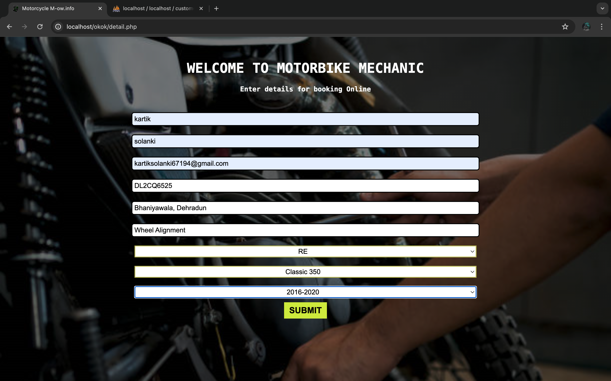
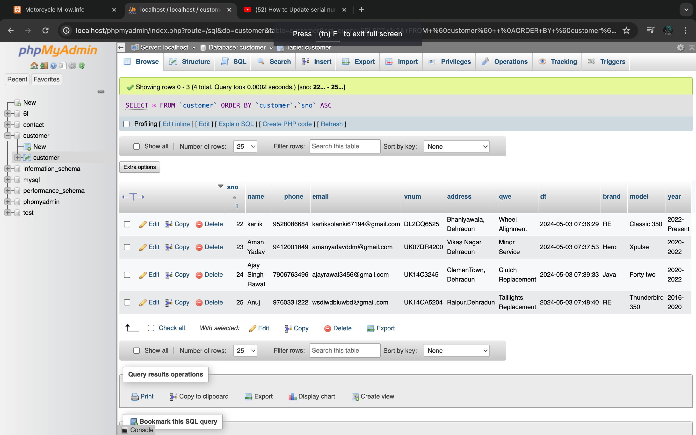

# WheelWizard

WheelWizard is a comprehensive bike maintenance website designed to streamline bike servicing, appointment scheduling, and maintenance tracking. Built using PHP, MySQL, and XAMPP, this project provides a user-friendly platform for bike owners to schedule services, track past maintenance, and access a knowledge base for common bike issues.

🔥 Key Features

✅ Appointment Scheduling – Book and manage service appointments easily.

✅ Maintenance Tracking – View service history and upcoming maintenance schedules.

✅ Knowledge Base – Access troubleshooting guides for common bike issues.

✅ User Authentication – Secure login and user profile management.

✅ Admin Dashboard – Manage bookings, users, and service records efficiently.

🛠 Technologies Used

1. Frontend: HTML, CSS, JavaScript

2. Backend: PHP (XAMPP)
   
3. Database: MySQL

4. Server: Apache (XAMPP)

   
🛠 Installation & Setup

1️⃣ Clone the Repository

-> git clone https://github.com/yourusername/WheelWizard.git

-> cd WheelWizard

2️⃣ Set Up XAMPP

-> Download and install XAMPP from Apache Friends.

-> Start Apache and MySQL services from the XAMPP Control Panel.

3️⃣ Import the Database

-> Open phpMyAdmin (http://localhost/phpmyadmin/).

-> Create a new database named wheelwizard.

4️⃣ Run the Project

-> Move the project folder to C:\xampp\htdocs\WheelWizard.

-> Open a browser and go to: http://localhost/WheelWizard/

📌 Future Enhancements

🚀 Automated Service Reminders – Email/SMS alerts for upcoming maintenance

🚀 Online Payment Integration – Secure payment processing for service bookings

🚀 Mobile App Support – Companion app for on-the-go service management

